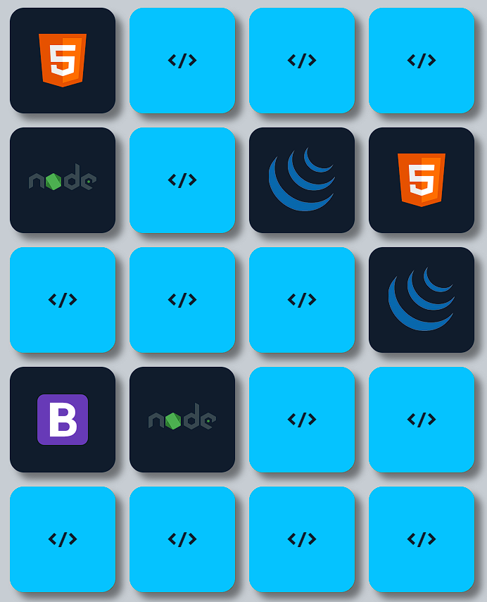

<h1 align="center"> Habits </h1>

Jogo da memoria desenvolvida com HTML,CSS, JavaScript, com imagens das principais tecnologias da atualidade, projeto desenvolvido no curso fullstack do <a href="https://programadorbr.com/">ProgramadorBr</a>

  <a href="#-tecnologias">Tecnologias</a>&nbsp;&nbsp;&nbsp;|&nbsp;&nbsp;&nbsp;
  <a href="#-projeto">Projeto</a>&nbsp;&nbsp;&nbsp;|&nbsp;&nbsp;&nbsp;
  <a href="#memo-licença">Licença</a>

  

 

  

## 🚀 Tecnologias

Esse projeto foi desenvolvido com as seguintes tecnologias:

- HTML e CSS
- JavaScript
- Git e Github

## 💻 Projeto

O jogo da memória é um clássico jogo formado por peças que apresentam uma figura em um dos lados. Cada figura se repete em duas peças diferentes.

- [Acesse o projeto finalizado, online](https://github.com/weyneMarxs/NLW---Setup---Habit)

## :memo: Licença

Esse projeto está sob a licença MIT.

---